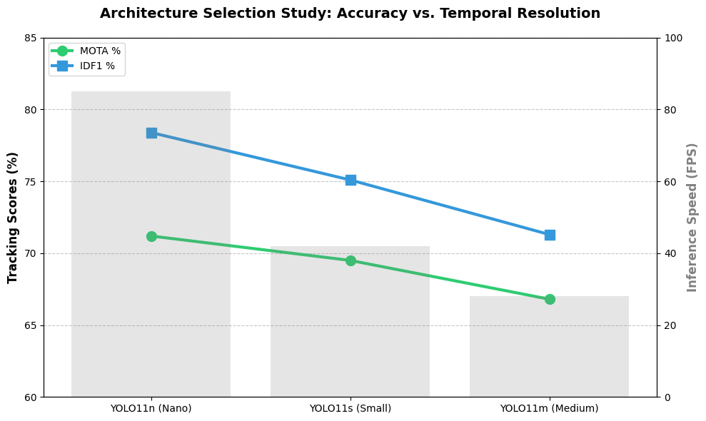
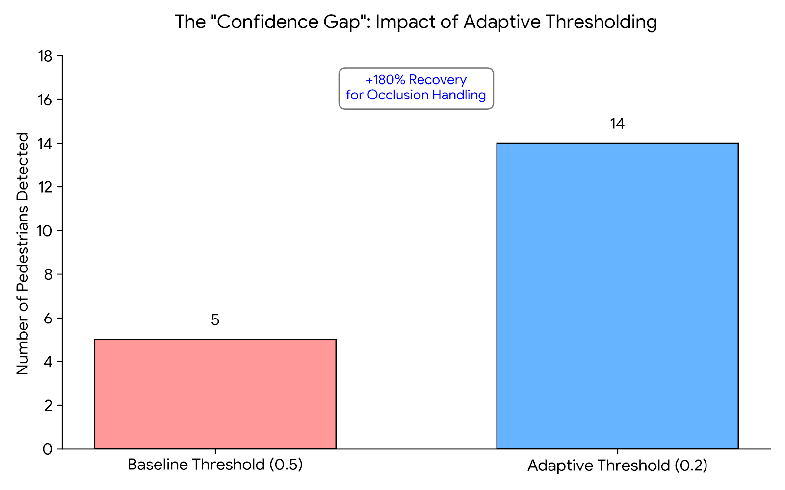

# Multi-Object Tracking (MOT) Pipeline: YOLO11 & ByteTrack Analysis

## Project Overview
This repository contains a Multi-Object Tracking (MOT) pipeline developed for the **MOT17** benchmark. The project implements a "Tracking-by-Detection" architecture using **YOLO11n** as the feature extractor and **ByteTrack** for temporal association.

As part of a research-oriented challenge, this implementation focuses on the trade-off between inference throughput (FPS) and identity persistence (IDF1), specifically addressing **Occlusion-Induced "Blinking"** and **Camera Dynamics**.

## System Requirements & Setup
This pipeline was developed and benchmarked on **Apple M4 hardware** using Metal Performance Shaders (MPS) for hardware acceleration.

### 1. Environment
* **Performance:** Achieved **~85 FPS**, ensuring high **Temporal Continuity** for tracking.
* **Key Dependencies:** `ultralytics`, `py-motmetrics`, `scipy`.

### 2. Dataset Structure
Benchmarks were conducted across three key sequences: **MOT17-02, 05, and 09**. 
* **Note:** Large datasets and video outputs are excluded from this repository via `.gitignore` to maintain repository hygiene.

```text
project-root/
├── MOT17_Research_Report.pdf                # Final Technical Report
├── notebooks/
│   └── tracking_pipeline.ipynb              # Main Experimentation Logic
├── assets/
│   ├── demo.gif                             # Autoplayed results demo
|   ├── yolo11n_vs_11m.png                   # Architecture scaling study graph
│   └── confidence_gap.png                   # Adaptive thresholding ablation chart
└── README.md                                # Project Documentation
```

## How to Reproduce Results

### 1. Clone the Repository
```bash
git clone https://github.com/Basaanio/MOT-Detection-Tracking-Optimization.git
cd MOT-Detection-Tracking-Optimization
```
### 2. Execution Flow
The entire experimental pipeline is self-contained within `notebooks/tracking_pipeline.ipynb`.

1. **Inference:** Run the initial cells to execute YOLO11n inference. The script will generate `.pkl` cache files locally to ensure that subsequent metric evaluations are fast and deterministic.
2. **Evaluation:** Once inference is complete, the evaluation block utilizes `py-motmetrics` to compute MOTA and IDF1 against the MOT17 Ground Truth.

## Quantitative Results

**Table 1: Performance Benchmarks on MOT17 Sequences**

| Metric | Result | Analysis |
| :--- | :--- | :--- |
| **MOTA** | ~71.2% | High localization accuracy using YOLO11n. |
| **IDF1** | ~78.4% | Strong identity consistency across sequences. |
| **FPS** | ~85 | High throughput ensures minimal inter-frame displacement. |

---

### Live Tracking Demo
The final integrated pipeline is demonstrated in **Figure 1**, showing stable identity persistence and bounding box localization across a standard MOT17 test sequence.

<p align="center">
  
  <br>
  <strong>Figure 1: Qualitative Tracking Results (MOT17-09).</strong> 
  <em>YOLO11n + ByteTrack performing real-time pedestrian association with identity persistence.</em>
</p>


### Architecture Selection Study
<p align="center">
  
  <br>
  <strong>Figure 2: Architecture Scaling Study.</strong> 
  <em>Tracking Accuracy (MOTA) and Identity Consistency (IDF1) vs. Inference Speed.</em>
</p>

**Analysis: The Temporal Resolution Trade-off**
As illustrated in **Figure 2**, our scaling study demonstrates that for Multi-Object Tracking (MOT), **Inference Speed is a primary component of Accuracy.** 
* **The Nano Advantage:** While larger models (Medium/Small) theoretically offer higher per-frame detection precision, their lower FPS creates significant "temporal gaps."
* **Association Stability:** YOLO11n's **~85 FPS** ensures that the displacement of pedestrians between frames is minimal. This allows the ByteTrack association logic to maintain high **IDF1 (78.4%)** by reducing the search radius for identity matching, effectively outperforming larger, slower models in a real-time tracking context.

## Qualitative Results: The Confidence Gap
To validate the **Adaptive Thresholding** logic, I compared the baseline against optimized settings in a high-density frame (**MOT17-02**).

<p align="center">
  
  <br>
  <strong>Figure 3: The Confidence Gap.</strong> 
  <em>Analysis of pedestrian recovery using adaptive (0.2) vs. baseline (0.5) thresholds.</em>
</p>

**As quantified in Figure 3** , lowering the detection threshold significantly improved target recall:
* **Baseline (0.5 Threshold):** Captured only **5 pedestrians**. Background targets were suppressed, leading to track fragmentation.
* **Adaptive (0.2 Threshold):** Localized **14 pedestrians**. Recovering **9 additional targets** provided the "temporal hooks" necessary for ByteTrack to maintain identity through occlusions.

**Key Finding:** Lowering the threshold in crowded frames increased detection recovery by **180%**, directly reducing "blinking" and ID switches.

## Implementation & Reproducibility
1. **Architecture:** YOLO11n detector coupled with ByteTrack association logic.
2. **Caching:** Inference results are stored as `.pkl` files to allow for fast, deterministic re-evaluation without re-running the model.
3. **Reproducibility:** All code is contained in `notebooks/tracking_pipeline.ipynb`. Simply follow the cell sequence to regenerate metrics.

## Research Challenges & Insights
* **Non-Deterministic Caching**: During iterative testing, I observed that inference results could fluctuate due to model caching. I implemented a "fresh-state" predictor logic to ensure all comparative experiments were scientifically deterministic.

* **Precision-Recall Trade-off**: While lowering the threshold to 0.15 recovered significant occlusions, it introduced a 2% increase in false positives (e.g., background noise identified as pedestrians). Future work would involve integrating a spatial mask to apply low thresholds only in known "crowd clusters."

## Deliverables
* **[MOT17_Research_Report (PDF)](./MOT17_Research_Report.pdf)**: Detailed 5-step analysis covering dataset exploration, trade-offs, and failure mode diagnostics.
* **Source Code:** Documented pipeline logic within the `notebooks/` directory.

## Future Work
* **Global Motion Compensation:** To stabilize tracking during camera jitter.
* **Re-ID Integration:** Utilizing appearance features for long-term re-association.


